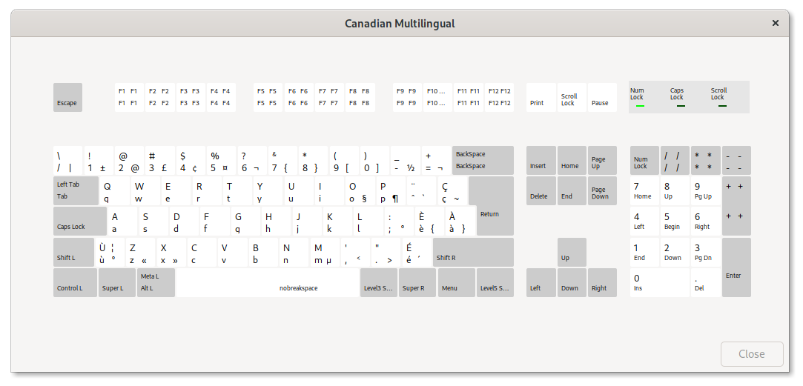

# Canadian Multilingual Standard keyboard layout for Linux

This adds the Canadian Multilingual Standard keyboard layout to the Linux
console.

For reference the layout is based on the screenshot below, from the Gnome
keyboard settings.

The file should be copied into `/usr/share/kbd/keymaps/i386/qwerty` or
`/usr/share/keymaps/i386/qwerty` depending on your distro. On Debian you might
need the `console-data` package.
